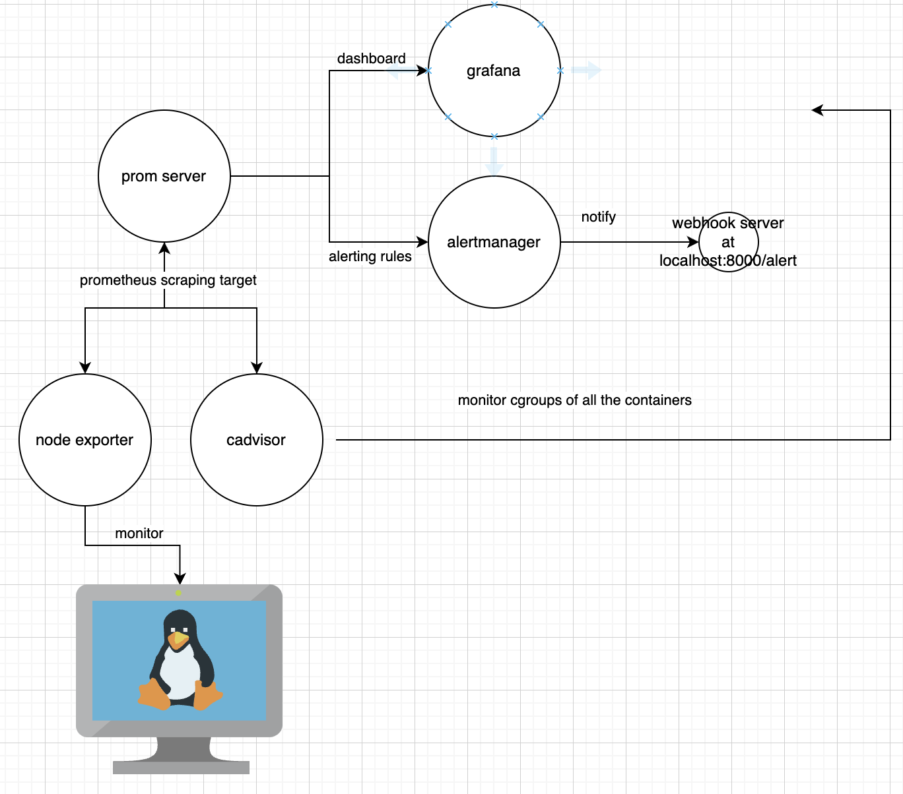

# Tools used
- Monitoring& Visualizing& Alerting : prom/ grafana/ alertmanager
- Metric Collection Tools: cadvisor-node/ exporter

# Project Workflow Overview

### alerting rules

- prom-nodeexporter metric name documentation: https://github.com/prometheus/node_exporter
- cadvisor metric name documentation: https://github.com/google/cadvisor/blob/master/docs/storage/prometheus.md
___

# Documentation used 
### prom 
- webhook: https://prometheus.io/docs/alerting/latest/configuration/
- api management: https://prometheus.io/docs/prometheus/latest/management_api/
- prom recording rules: https://prometheus.io/docs/prometheus/latest/configuration/recording_rules/
- alertmanager https://prometheus.io/docs/alerting/latest/configuration/
### grafana 
- prometheus datasource: https://grafana.com/docs/grafana/latest/datasources/prometheus/
- dashboard: https://grafana.com/docs/grafana/latest/dashboards/build-dashboards/view-dashboard-json-model/
___

### resource allocation
https://www.geeksforgeeks.org/configure-docker-compose-memory-limits/

### webhook
https://youtu.be/xSjFiR0A70I?si=DzkLWhd9kYNhLcE-